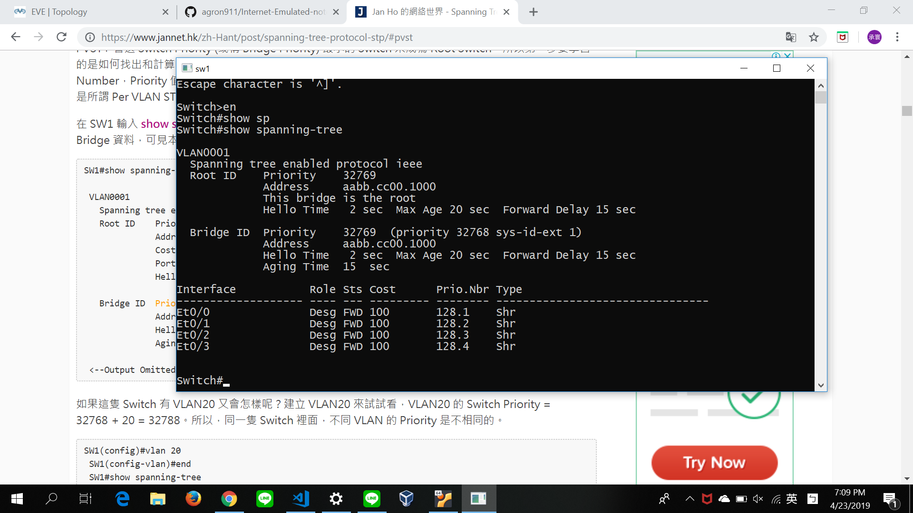

# STP (Spanning Tree Protocol)

* 在logical上，形成Tree架構

1.找到根交換機
** First,find switch priority = priority + vlan number (Choose the lowest one, 預設priority:32768 vlan number:1) 
** Second,比較 Address
** Third, 強制設置

2.選root port
** First, 計算距離最短,選擇成本最小(頻寬)

3.選DP || NDP

