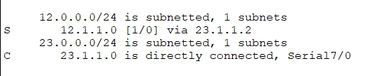
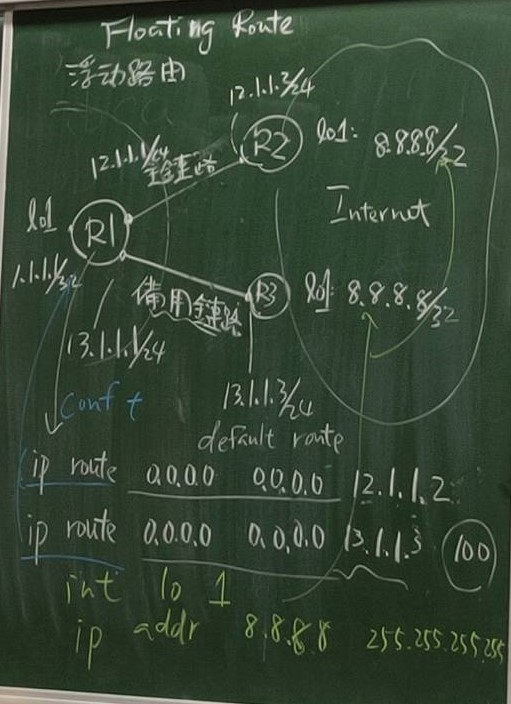
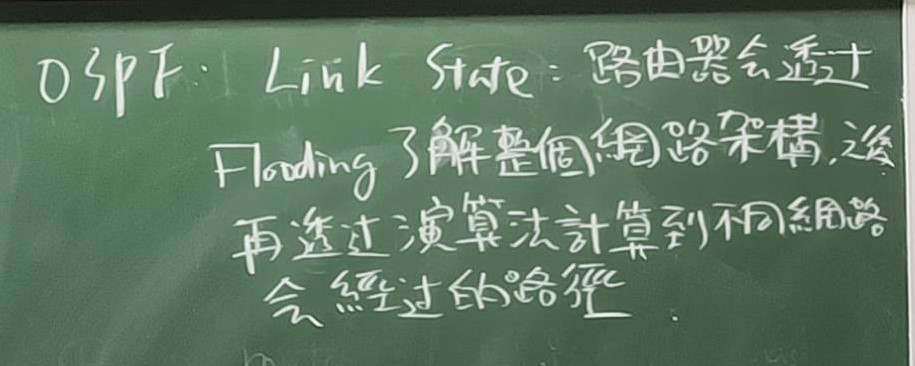

# Cisco packet Tracer

#### cisco serial
*關閉DNS查詢功能
```no ip domain lookup```
*查看route table
```do show ip route```
*查看ping封包
```
debug ip icmp
undebug all
```

## 靜態路由
* ip route 網路位址 mask 下一跳(ip)

* ip route 網路位址 mask 序列阜(自己的)



* 可看到 [1/0] ，1的位置:(AD)管理距離, 0的位置: 度

## Floating route 浮動路由


* 利用權重(AD)的不同讓其中一條的管道成為備用的

## 動態路由 
1.IGP (自治網路內)
 * RIP
 * OSPF
 * EIGRP
2.EGP (自治網路和自治網路交換)

#### RIP
* Routing 
* Indormation
* Protocol
* Ipv4


* 在做資訊交換時，RIPv1 是不支持認證, RIPv2 支持認證(相較安全)
* RIP 屬於Distance vector(距離向量,下一跳是誰), AD:120
無法先看清整個網路架構

從B跳3跳到P


* OSPF, Link State (可看見整個網路架構)



R1
```設路由協定
router rip
version 2
no auto-summary
network 12.1.1.0 
do show ip route
```

R2
```
router rip 
version 2
no auto-summary
network 23.1.1.0
network 12.1.1.0
```
