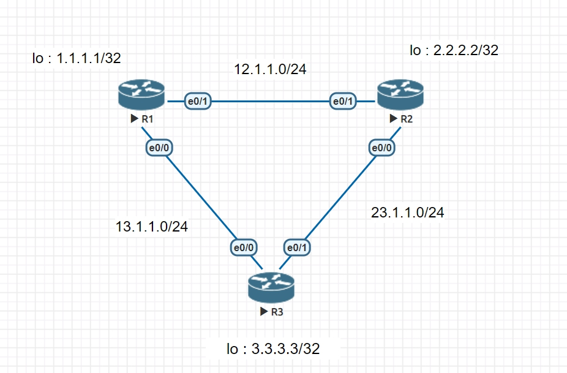
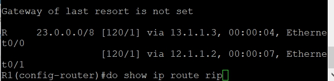
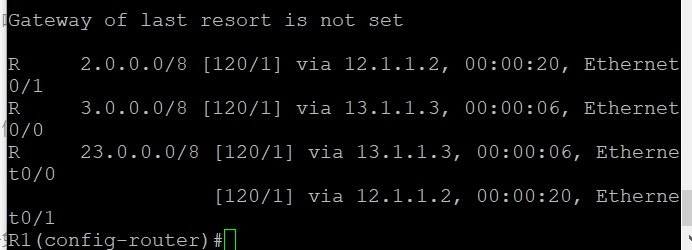
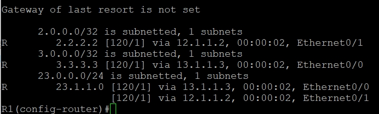

# RIP路由自動匯總 aut0-summary
* auto-summary
* no auto-summary
### 路由信息協議(RIP) 是內部網關協議IGP中最先得到使用的協議。RIP是一種分布式的基於距離矢量的路由選擇協議，是網際網路的標準協議，其最大優點就是實現簡單，開銷較小。
舉一個最簡單的例子,有兩台路由器A和B,
A連接著172.16.12.0,172.16.13.0,172.16.14.0,172.16.15.0的內網
A與B連接時使用192.168.12.0的網段, B連接Internet

這樣看來,A是連接著兩個不同類的網絡的,那它就會將內網的網段自動匯總成一條172.16.0.0的路由給B~這就是自動匯總~

#### 這個命令在RIPv2和EIGRP上面使用~OSPF的自動匯總功能默認是關閉的

* 參考資料 : https://www.itread01.com/content/1530940908.html

## Prove router rip will change
* R2
```
# int e0/1
# ip addr 10.1.2.3 255.255.255.0
# no shut
# int e0/0
# ip addr 192.168.10.1 255.255.255.0
# no shut
# router rip
# version 2
# no auto-summary
# network 10.1.2.3
# network 192.168.10.1
# do show running
```


* R3
```
int e0/0
ip addr 
```

## 

### R1 , R2 , R3
#### Set the ip as the picture
* R1: ip: 12.1.1.1,13.1.1.1  lo: 1.1.1.1      //lo:lookback
* R2: ip: 12.1.1.2,23.1.1.2  lo: 2.2.2.2
* R3: ip: 13.1.1.3,23.1.1.3  lo: 3.3.3.3
R1
```
# router rip     //(v1)
# network 12.1.1.1
# network 13.1.1.1
# network 1.1.1.1
```
R2
```
# router rip     //(v1)
# network 12.1.1.2
# network 23.1.1.2
# network 2.2.2.2 
```
R3
```
# router rip     //(v1)
# network 13.1.1.3
# network 23.1.1.3
# network 3.3.3.3
```
#### EX: if we check the ip route
```
# do show ip route rip
```
with no 'network lo'



with 'network lo'



#### you can find out that if R1 want to check out the internet 23.0.0.0/8 it can through 12.1.1.2 and 13.1.1.3, and it cost the same , so called 等價路由

## The one use rip version2
R1
```
# route rip
# version 2
# no auto-summary
```
R2
```
# route rip
# version 2
# no auto-summary
```
R3
```
# route rip
# version 2
# no auto-summary
```


* 解析相對version 1 更清楚 

