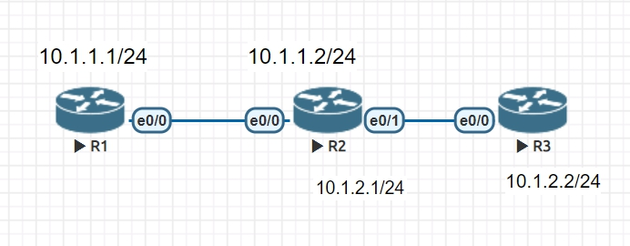
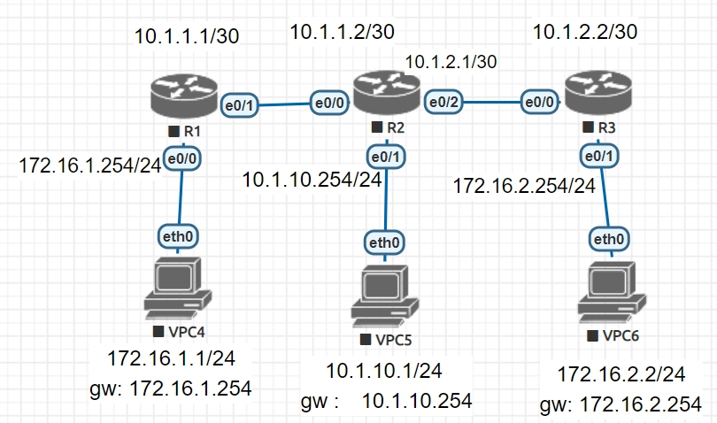

# router

* network 的作用
1. 激活接口 : 讓接口可收可發rip封包
2. 宣告網段


* R1 , R2 , R3
R1
```
$ router rip
$ network 10.1.1.1
```
R2
```
$ router rip
$ network 10.1.1.2
```
R3
```
$ router rip
$ network 10.1.2.2
```
* R1 即可 ping 到R3

```
# show ip protocols
```
## Router Rip version differential

### v1
* 無網路遮罩
* 

### v2
* 有網路遮罩

### 不匯總 NO auto-summary


### RIP


* 先選擇AD小的，若AD想同選擇網路遮罩長度較長的