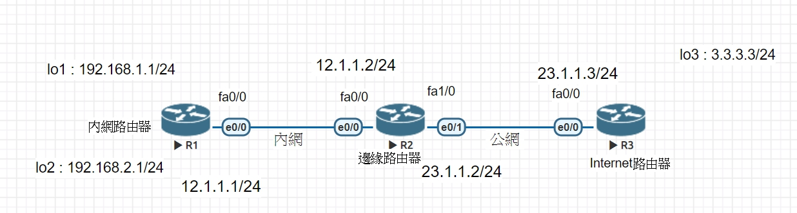

# NAT 

* 動態NAT:實現多對多動態地址映射,需要購買大量的位址,用於實現內網訪問internet,比較消耗地址資源。
* 端口NAT:Port NAT(PNAT)實現多對少的地址覆用,也是目前最常用的方式。
* 靜態NAT:實現一對一的地址映射。

* R1,R2,R3
R1
```
#int e0/0 
#ip addr 12.1.1.1 255.255.255.0
#no shut
#int lo 1
#ip addr 192.168.1.1 255.255.255.0
#no shut
#int lo 2
#ip addr 192.168.2.1 255.255.255.0
#no shut
```
R2
```
#int e0/0 
#ip addr 12.1.1.2 255.255.255.0
#no shut
#int e0/1
#ip addr 23.1.1.2 255.255.255.0
```
R3 (just do the similar thing like R1 & R2)

--開始設定默認路由
R1
``` 都要到 configure 模式
#ip route 0.0.0.0 0.0.0.0 12.1.1.2      //下一跳得位址
```
R2
```
#ip route 0.0.0.0 0.0.0.0 23.1.1.3
#ip route 192.168.1.0 255.255.255.0 12.1.1.1    //將192.168.1.0網段之封包交由12.1.1.1傳送
#ip route 192.168.2.0 255.255.255.0 12.1.1.1
```
* For now
    1. (R2)# ping 3.3.3.3 --OK
    2. (R1)# ping 3.3.3.3 --Fail //因為 R3無法傳送封包道R1

R2
```
#access-list 1 permit 192.168.1.0 0.0.0.255
#access-list 2 permit 192.168.2.0 0.0.0.255
#ip nat pool DNAT 23.1.1.100 23.1.1.200 netmask 255.255.255.0
#int e0/0
#ip nat inside
#int e0/1
#ip nat outside
#ip nat inside source list 1 pool DNAT  // 1
#ip nat inside source list 2 pool DNAT  // 2
```