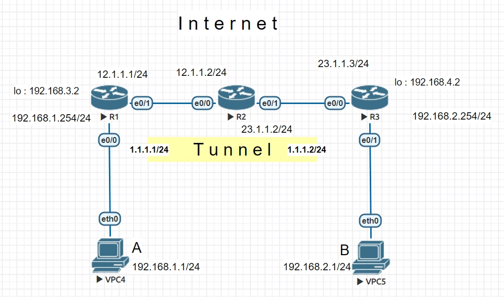

# VPN  (virtual private network)

### (Today's topic) site to site, L2L or LAN to LAN

* 使用GRE技術,Generic Routing encapsulation, 一種VPN技術。
* 會在兩個physical Interface 之間建立一個tunnel



#### R1
```
R1(config)#int tunnel 12
R1(config-if)#ip address 172.16.12.1 255.255.255.0
R1(config-if)#tunnel source ethernet 1/0
R1(config-if)#tunnel destination 10.0.24.2
```
#### R2
```
R2(config)#int tunnel 12
R2(config-if)#ip address 172.16.12.2 255.255.255.0
R2(config-if)#tunnel source ethernet 1/0
R2(config-if)#tunnel destination 10.0.14.1
```
#### R1 與 R3 之間建立 Tunnel
```
--R1
R1(config)#int tunnel 13
R1(config-if)#ip address 172.16.13.1 255.255.255.0
R1(config-if)#tunnel source ethernet 1/0
R1(config-if)#tunnel destination 10.0.34.3

--R3
R3(config)#int tunnel 13
R3(config-if)#ip address 172.16.13.3 255.255.255.0
R3(config-if)#tunnel source ethernet 1/0
R3(config-if)#tunnel destination 10.0.14.1

```
### Now, R1 已經可以 Ping 通 R2 和 R3 的 Tunnel Interface 了


